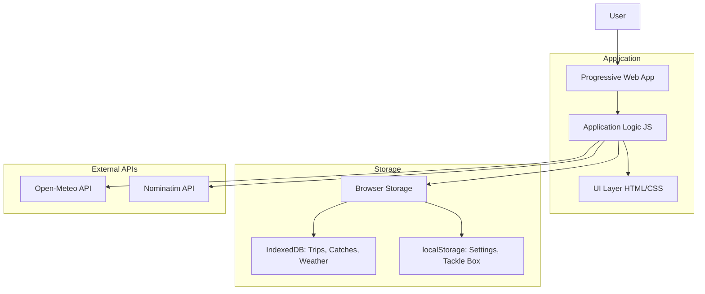
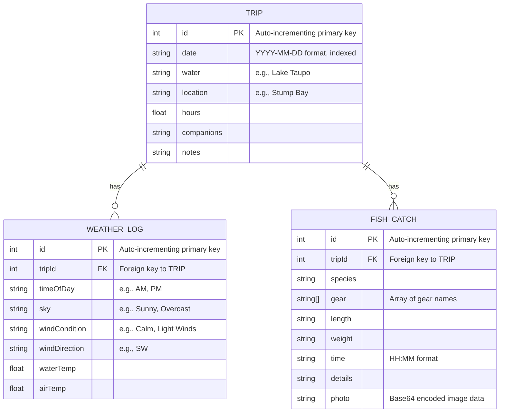

# Technical Blueprint: Māori Fishing Calendar PWA

## 1. System Architecture

### 1.1. Overview

This application is a client-side Progressive Web App (PWA). There is no proprietary backend server. All application logic, data processing, and rendering occur directly within the user's web browser. User data is stored exclusively on the user's device, ensuring data privacy and offline accessibility for core features.

The system can be broken down into four main parts:
1.  **UI Layer**: The user interface, responsible for displaying the calendar, modals, forms, and analytics.
2.  **Application Logic Layer**: The core JavaScript code that manages state, handles user input, performs calculations (e.g., bite times), and orchestrates data flow.
3.  **Storage Layer**: The persistence layer, which uses browser storage technologies (`IndexedDB` for structured data like trips and catches, and `localStorage` for simpler data like user settings and the tackle box).
4.  **External Services**: Third-party APIs that provide supplemental data, such as weather forecasts and geolocation services.

### 1.2. Architecture Diagram



### 1.3. Core Principles

*   **Client-Centric**: All core logic runs on the client. The application is fully functional without a persistent internet connection, with the exception of fetching new weather or location data.
*   **Data Privacy by Design**: No user-generated data (trip logs, catches, photos, gear) is ever transmitted to a server. It remains under the user's control within their browser's storage.
*   **Offline First**: The use of a Service Worker and client-side storage ensures that the application shell and all previously saved user data are accessible offline.

### 1.4. External Dependencies

#### APIs
*   **Weather Forecast**: `api.open-meteo.com` - Used to fetch daily weather forecasts for a specific latitude and longitude.
*   **Geolocation**: `nominatim.openstreetmap.org` - Used for both forward geocoding (searching for a location name) and reverse geocoding (finding a location name from GPS coordinates).

#### Libraries (via CDN)
*   **Astronomical Calculations**: `SunCalc.js` - Core library for calculating sun and moon positions, which are essential for determining bite times.
*   **Charting**: `Chart.js` - Used to render all charts in the Analytics Dashboard.
*   **File Handling**: `JSZip.js` & `PapaParse.js` - Used for the data import/export feature to create and read ZIP archives and CSV files.
*   **Styling & Icons**: `TailwindCSS` & `FontAwesome` - Used for the UI's appearance.

## 2. Data Models

The application uses a combination of `IndexedDB` for structured, relational data and `localStorage` for simpler data structures and user settings. Additionally, it uses a hardcoded data structure for the lunar calendar information.

### 2.1. Entity-Relationship Diagram (ERD)

This diagram illustrates the relationships between the main data entities stored in `IndexedDB`.



*Note: The relationship between `FISH_CATCH` and `TackleItem` (from `localStorage`) is not a strict foreign key relationship. The `gear` array in `FISH_CATCH` stores the names of the gear items as strings.*

### 2.2. IndexedDB Entities

These entities are stored in `IndexedDB` as it is well-suited for storing large amounts of structured data and provides transactional, indexed access.

#### Table: `Trip`
**Storage**: IndexedDB, `trips` object store.

| Attribute    | Type         | Description                                     | Example                  |
|--------------|--------------|-------------------------------------------------|--------------------------|
| `id` (PK)    | Integer      | Auto-incrementing unique identifier for the trip. | `1678886400000`          |
| `date`       | String       | The date of the trip in `YYYY-MM-DD` format. This field is indexed for efficient querying. | `"2023-03-15"`           |
| `water`      | String       | The name of the water body.                     | `"Lake Taupo"`           |
| `location`   | String       | A more specific location.                       | `"Stump Bay"`            |
| `hours`      | Number       | The number of hours fished.                     | `4.5`                    |
| `companions` | String       | Names of fishing companions.                    | `"John Doe, Jane Smith"` |
| `notes`      | String       | General notes about the trip.                   | `"Good bite in the morning."` |

#### Table: `FishCatch`
**Storage**: IndexedDB, `fish_caught` object store.

| Attribute | Type         | Description                                                                                             | Example                                    |
|-----------|--------------|---------------------------------------------------------------------------------------------------------|--------------------------------------------|
| `id` (PK) | Integer      | Auto-incrementing unique identifier.                                                                    | `1`                                        |
| `tripId`  | Integer      | Foreign key linking to the `Trip.id`. This field is indexed.                                            | `1678886400000`                            |
| `species` | String       | The species of the fish caught.                                                                         | `"Rainbow Trout"`                          |
| `gear`    | Array<String>| An array of gear item names and any custom bait used.                                                     | `["Spinning Rod", "Green Spinner", "Worms"]` |
| `length`  | String       | The length of the fish (stored as string to allow units like "cm").                                     | `"55cm"`                                   |
| `weight`  | String       | The weight of the fish (stored as string to allow units like "kg").                                     | `"2.5kg"`                                  |
| `time`    | String       | The time of the catch in `HH:MM` format.                                                                | `"08:30"`                                  |
| `details` | String       | Any other notes specific to this catch.                                                                 | `"Caught near the drop-off."`              |
| `photo`   | String       | A Base64 encoded string of the catch photo. Can be null.                                                | `"data:image/jpeg;base64,..."`             |

#### Table: `WeatherLog`
**Storage**: IndexedDB, `weather_logs` object store.

| Attribute       | Type    | Description                                                                   | Example           |
|-----------------|---------|-------------------------------------------------------------------------------|-------------------|
| `id` (PK)       | Integer | Auto-incrementing unique identifier.                                          | `1`               |
| `tripId`        | Integer | Foreign key linking to the `Trip.id`. This field is indexed.                  | `1678886400000`   |
| `timeOfDay`     | String  | The general time of day for the observation.                                  | `"AM"`            |
| `sky`           | String  | The sky condition (e.g., "Sunny", "Overcast").                                | `"Partly Cloudy"` |
| `windCondition` | String  | The wind strength (e.g., "Calm", "Strong Winds").                             | `"Light Winds"`   |
| `windDirection` | String  | The cardinal direction of the wind.                                           | `"SW"`            |
| `waterTemp`     | Number  | The temperature of the water.                                                 | `15`              |
| `airTemp`       | Number  | The ambient air temperature.                                                  | `18`              |

### 2.3. localStorage Entities

These entities are stored in `localStorage`, which is suitable for simpler key-value storage of non-critical or less structured data.

#### Object: `TackleItem`
**Storage**: `localStorage`, key: `tacklebox`. Stored as an array of `TackleItem` objects.

| Attribute | Type    | Description                               | Example             |
|-----------|---------|-------------------------------------------|---------------------|
| `id` (PK) | Integer | Unique identifier (timestamp-based).      | `1678887000000`     |
| `name`    | String  | The name of the gear item.                | `"Z-Man GrubZ"`     |
| `brand`   | String  | The brand of the gear.                    | `"Z-Man"`           |
| `type`    | String  | The type of gear (links to `GearType`).   | `"Lure"`            |
| `colour`  | String  | The colour of the gear.                   | `"Motor Oil"`       |

#### Object: `GearType`
**Storage**: `localStorage`, key: `gearTypes`. Stored as an array of strings.

| Value  | Type   | Description           |
|--------|--------|-----------------------|
| String | String | A type of fishing gear. |

*Example Value*: `["Lure", "Rod", "Reel", "Line"]`

#### Object: `UserLocation`
**Storage**: `localStorage`, key: `userLocation`. Stored as a single JSON object.

| Attribute | Type   | Description                          | Example              |
|-----------|--------|--------------------------------------|----------------------|
| `lat`     | Number | Latitude of the user's location.     | `-38.6857`           |
| `lon`     | Number | Longitude of the user's location.    | `176.0702`           |
| `name`    | String | The display name of the location.    | `"Taupo, New Zealand"` |

### 2.4. Application Data

This data is hardcoded within the application logic and is not stored in browser storage.

#### Object: `MaramatakaPhase`
**Storage**: Hardcoded in `script.js`. An array of 30 `MaramatakaPhase` objects.

| Attribute       | Type          | Description                                                              | Example                                  |
|-----------------|---------------|--------------------------------------------------------------------------|------------------------------------------|
| `name`          | String        | The Māori name for the lunar day.                                        | `"Whiro"`                                |
| `quality`       | String        | The overall fishing quality for the day ("Excellent", "Good", "Average", "Poor"). | `"Poor"`                                 |
| `description`   | String        | A brief description of the day's significance.                           | `"The new moon. An unfavourable day for fishing."` |
| `biteQualities` | Array<String> | An array of four quality ratings corresponding to the day's major and minor bite times. | `["poor", "poor", "poor", "poor"]`   |

## 3. Core Components and Behaviors

This section details the application's features, breaking them down into individual components.

### 3.1. Calendar View

**Purpose**: To provide an at-a-glance, month-by-month view of the predicted fishing quality based on the Maramataka.

**UI Components**:
*   Month/Year Header (`#currentMonth`)
*   Previous/Next Month Buttons (`#prevMonth`, `#nextMonth`)
*   Calendar Grid (`#calendarDays`)
*   Individual Day Cells (`.calendar-day`)
*   Fishing Quality Indicator (`.quality-indicator`)
*   Trip Log Indicator (`.log-indicator`)
*   Fishing Quality Legend

**Behaviors**:
1.  **Display**: On load, the calendar displays the current month and year.
2.  **Navigation**: Users can navigate to the previous or next month using the arrow buttons or by swiping left/right on the calendar grid on touch devices.
3.  **Day Rendering**: Each day in the month is rendered in a grid cell.
    *   The day's number is displayed.
    *   The day's fishing quality (determined by `getMoonPhaseData`) is shown as a color-coded dot below the number. The mapping is: Excellent (green), Good (blue), Average (amber), Poor (red).
    *   Hovering over a day reveals the quality as text (e.g., "Good") and causes a slight zoom effect.
    *   If a trip has been logged for a specific day, a small fish icon appears in the bottom-right corner of the day cell.
    *   The current day is highlighted with a distinct border.
4.  **Interaction**: Clicking on any day cell opens the **Daily Detail Modal** for that specific day.

### 3.2. Daily Detail Modal

**Purpose**: To provide a comprehensive, detailed view of all relevant fishing information for a single selected day.

**UI Components**:
*   Modal container (`#lunarModal`)
*   Day/Previous Navigation Buttons (`#modalPrevDay`, `#modalNextDay`)
*   Close Button (`#closeModal`)
*   Lunar Phase Name and Description (`#modalTitle`, `#modalSummary`)
*   Date and Fishing Quality Badge (`#modalDate`, `#modalQuality`)
*   Moon Age and Illumination details
*   Location Search Input and Buttons (`#location-input`, `#search-location-btn`, `#use-location-btn`)
*   Bite Times Display (`#majorBites`, `#minorBites`)
*   Weather Forecast Display (`#weather-forecast-content`)
*   Sun and Moon Rise/Set Times (`#sun-moon-content`)
*   Trip Log Button (`#open-trip-log-btn`)

**Behaviors**:
1.  **Opening**: The modal opens when a day is clicked on the main calendar view.
2.  **Navigation**: Users can navigate to the previous or next day using the arrow buttons or by swiping left/right on touch devices. Each navigation action re-fetches and re-renders all data for the new day.
3.  **Data Display**:
    *   The modal displays the Maramataka phase name, description, and overall fishing quality for the selected day.
    *   If a user location is set, the modal calculates and displays:
        *   **Major and Minor Bite Times**: Calculated using the `calculateBiteTimes` algorithm. Each bite time window is shown with a quality-colored fish icon.
        *   **Weather Forecast**: Fetched from the Open-Meteo API for the user's location and the selected date.
        *   **Sun/Moon Times**: Sunrise, sunset, moonrise, and moonset times are calculated using `SunCalc.js`.
    *   If no location is set, these sections prompt the user to set a location.
4.  **Location Handling**: Users can set or change their location from within this modal. See **Location Handling** (section 3.8) for details.
5.  **Trip Logging**: A button at the bottom allows the user to access the trip logging functionality for the selected day. The button text changes to "View / Manage Trip Log" if a log already exists, or "Create Trip Log" if one does not.

### 3.3. Trip Logging

**Purpose**: To allow users to create, view, update, and delete detailed logs of their fishing trips and the specific catches and weather conditions associated with them. This feature is a nested set of modals.

#### 3.3.1. Trip Log Summary Modal

**UI Components**:
*   Modal container (`#tripLogModal`)
*   "Log a New Trip" button (`#add-trip-btn`)
*   List of existing trips for the day (`#trip-log-list`)

**Behaviors**:
1.  **Opening**: Accessed by clicking the trip log button in the **Daily Detail Modal**.
2.  **Display**:
    *   Lists all trips logged for the selected date.
    *   For each trip, it displays the water body, location, hours fished, companions, and notes.
    *   Each trip card has buttons to "Edit Trip" and "Delete Trip".
    *   Each trip card contains dedicated sections for associated **Weather Logs** and **Fish Catches**, with buttons to add new ones.
3.  **Interaction**:
    *   Clicking "Log a New Trip" opens the **Trip Details Modal** in "add" mode.
    *   Clicking "Edit Trip" opens the **Trip Details Modal** in "edit" mode, pre-filled with that trip's data.
    *   Clicking "Delete Trip" prompts for confirmation and then deletes the trip and all its associated weather and fish data from `IndexedDB`.
    *   Clicking "Add Weather" or "Add Fish" opens their respective modals.

#### 3.3.2. Trip Details Modal (Add/Edit Trip)

**UI Components**:
*   Modal container (`#tripDetailsModal`)
*   Input fields for water body, location, hours, companions, notes.
*   "Save Trip" / "Update Trip" button.

**Behaviors**:
1.  **Data Entry**: User fills in the details for their trip. The "Save" button is disabled until at least one field has content.
2.  **Saving**: On save, the data is written to the `trips` object store in `IndexedDB`. If it's a new trip, a new record is created. If it's an edit, the existing record is updated.
3.  **Closing**: The modal closes upon saving, and the **Trip Log Summary Modal** refreshes to show the new/updated information.

#### 3.3.3. Weather Log Modal (Add/Edit Weather)

**UI Components**:
*   Modal container (`#weatherModal`)
*   Dropdowns for time of day, sky conditions, wind conditions.
*   Inputs for wind direction, water temp, air temp.
*   "Save Weather" button.

**Behaviors**:
1.  **Context**: This modal is always associated with a specific trip.
2.  **Saving**: On save, the weather data is written to the `weather_logs` object store in `IndexedDB`, linked by `tripId`.
3.  **Closing**: The modal closes, and the weather list on the parent trip card is refreshed.

#### 3.3.4. Fish Catch Modal (Add/Edit Fish)

**UI Components**:
*   Modal container (`#fishModal`)
*   Inputs for species, length, weight, time of catch, details.
*   A button to open the **Gear Selection Modal**.
*   A file input to upload a photo.
*   "Save Fish" button.

**Behaviors**:
1.  **Context**: Always associated with a specific trip.
2.  **Gear Selection**: Users can select gear from their pre-defined Tackle Box or enter custom bait/lures.
3.  **Photo Upload**: Users can attach a photo to the catch. The photo is read by the `FileReader` API and stored as a Base64 string in `IndexedDB`.
4.  **Saving**: On save, the fish data is written to the `fish_caught` object store in `IndexedDB`, linked by `tripId`.
5.  **Closing**: The modal closes, and the fish list on the parent trip card is refreshed. The total fish count for the trip is also updated.

### 3.4. Tackle Box Management

**Purpose**: To provide a digital inventory for users to manage their fishing gear.

**UI Components**:
*   Tackle Box Button (in main header)
*   Modal container (`#tackleboxModal`)
*   Dropdowns to select existing gear items or gear types for editing.
*   "Add New Gear" and "Add New Type" buttons.
*   A form area for adding/editing a gear item's details (name, brand, type, colour).
*   A form area for adding/editing a gear type's name.

**Behaviors**:
1.  **Opening**: The user clicks the "Tackle Box" icon in the header to open the modal.
2.  **Data Storage**: All data is stored in `localStorage`. Gear items are in a `tacklebox` array, and gear types are in a `gearTypes` array.
3.  **CRUD for Gear Items**:
    *   **Create**: Users click "Add New Gear", fill out the form, and save. A new object is added to the `tacklebox` array.
    *   **Read**: Users select a gear item from the dropdown to view its details in the form.
    *   **Update**: After selecting an item, users can modify its details and save the changes. The corresponding object in the `tacklebox` array is updated.
    *   **Delete**: After selecting an item, a "Delete" button appears. Clicking it (with confirmation) removes the item from the `tacklebox` array.
4.  **CRUD for Gear Types**:
    *   **Create**: Users click "Add New Type", provide a name, and save. The new name is added to the `gearTypes` array.
    *   **Read**: Users select a type from the dropdown to view it in the form.
    *   **Update**: After selecting a type, users can rename it. This action updates the string in the `gearTypes` array AND updates the `type` property of all associated gear items in the `tacklebox` array.
    *   **Delete**: After selecting a type, a "Delete" button appears. Clicking it (with confirmation) removes the type from the `gearTypes` array AND removes all gear items of that type from the `tacklebox` array.

### 3.5. Analytics Dashboard

**Purpose**: To visualize the user's logged data, helping them identify patterns and insights into their fishing habits.

**UI Components**:
*   Analytics Button (in main header)
*   Modal container (`#analyticsModal`)
*   Total fish caught counter.
*   Canvas elements for charts (`#moon-phase-chart`, `#species-chart`, etc.).
*   Personal Bests display area.
*   General Insights display area.
*   Interactive Gear Insights filters (dropdowns for species and gear type).

**Behaviors**:
1.  **Opening**: The user clicks the "Analytics" icon in the header. If no fish have been logged, an alert is shown and the modal does not open.
2.  **Data Aggregation**: On open, the application reads all data from the `trips`, `fish_caught`, and `weather_logs` object stores in `IndexedDB`.
3.  **Chart Rendering**: The aggregated data is used to render several charts using `Chart.js`:
    *   **Performance by Moon Phase**: A bar chart showing the number of fish caught during each Maramataka phase.
    *   **Catch Breakdown (Pies/Bars)**: Charts showing the distribution of catches by species, location, gear, and weather conditions.
    *   Charts are not rendered if there is no relevant data to display.
4.  **Insights Display**:
    *   **General Insights**: Text-based insights are generated, such as the most successful moon phase or weather condition.
    *   **Personal Bests**: Displays the heaviest fish, longest fish, and most fish caught in a single trip.
    *   **Top Gear Performance**: An interactive section where users can filter by a target species and gear type to see a ranked list of their most successful individual gear items.

### 3.6. Data Management (Import/Export)

**Purpose**: To allow users to back up their data and transfer it between devices.

**UI Components**:
*   Settings Button (in main header)
*   Modal container (`#settingsModal`)
*   "Export as JSON", "Export as CSV" buttons.
*   An "Import Data" button (styled as a button, but is a file input).

**Behaviors**:
1.  **Opening**: Accessed via the "Settings" icon in the header.
2.  **Export**:
    *   User clicks an export button.
    *   The application reads all data from `IndexedDB` (`trips`, `fish_caught`, `weather_logs`) and `localStorage` (`tacklebox`, `gearTypes`).
    *   For exports including photos, the Base64 photo data is extracted.
    *   The data is packaged into a `.zip` archive using `JSZip`.
        *   For JSON export, the zip contains `data.json` and a `photos/` folder.
        *   For CSV export, the zip contains `trips.csv`, `fish.csv`, `weather.csv`, and a `photos/` folder. `PapaParse` is used for CSV creation.
    *   The zip file is then triggered for download in the user's browser.
3.  **Import**:
    *   User clicks the "Import Data" button and selects a `.zip` or `.json` file.
    *   A confirmation prompt is shown, warning the user that importing will overwrite all existing data.
    *   If confirmed, the application logic proceeds:
        *   The selected file is read. If it's a zip, it's unzipped.
        *   The contained data (`data.json` or CSV files) is parsed.
        *   The application completely clears all existing data from the relevant `IndexedDB` object stores and `localStorage` keys.
        *   The parsed data is then inserted into the now-empty stores.
        *   The page reloads to reflect the newly imported state.

### 3.7. Photo Gallery

**Purpose**: To provide a visually appealing way for users to browse all photos from their catches.

**UI Components**:
*   Gallery Button (in main header)
*   Modal container (`#galleryModal`)
*   A grid for displaying photos (`#gallery-grid`)
*   Sort button (`#gallery-sort-btn`)
*   Catch Detail Modal (`#catchDetailModal`) for viewing a single photo and its details.

**Behaviors**:
1.  **Opening**: The user clicks the "Gallery" icon in the header.
2.  **Data Fetching**: The application fetches all `FishCatch` records that contain a `photo`.
3.  **Display**:
    *   Photos are grouped by month and year (e.g., "August 2023").
    *   Within each month, photos are displayed in a grid.
    *   Hovering over a photo shows an overlay with the fish species name.
4.  **Sorting**: The user can toggle sorting the month groups between newest-first (descending) and oldest-first (ascending).
5.  **Interaction**: Clicking on any photo in the grid opens the **Catch Detail Modal**. This modal shows a larger version of the photo along with key details about the catch (species, size, date, location, etc.).

### 3.8. Catch Search

**Purpose**: To allow users to quickly find specific catch logs based on a keyword.

**UI Components**:
*   Search Button (in main header)
*   Modal container (`#searchModal`)
*   Search input field (`#search-input`)
*   Search results container (`#search-results-container`)

**Behaviors**:
1.  **Opening**: The user clicks the "Search" icon in the header.
2.  **Searching**:
    *   The user types a query (e.g., "Snapper", "January", "Stump Bay") and clicks "Search" or presses Enter.
    *   The application performs a case-insensitive search across all `FishCatch` and their associated `Trip` records. Searchable fields include species, bait, details, water body, location, and notes.
    *   The query can also be a month name to find all catches from that month.
3.  **Display**: The results are displayed as a list of cards in the results container, with each card showing the details of a matching catch.

### 3.9. Location Handling

**Purpose**: To get the user's location to provide accurate, localized bite times and weather.

**UI Components**:
*   Location input field and search/GPS buttons within the **Daily Detail Modal**.
*   A "Set Location" button on the main page if no location is stored.

**Behaviors**:
1.  **Storage**: The user's location (`lat`, `lon`, `name`) is stored in the `userLocation` object in `localStorage`.
2.  **Automatic (GPS)**:
    *   User clicks the GPS icon.
    *   The browser's `Geolocation.getCurrentPosition()` API is called to get the device's coordinates.
    *   The coordinates are sent to the Nominatim API for reverse geocoding to get a human-readable location name.
    *   The location is saved to `localStorage` and the UI is updated.
3.  **Manual (Search)**:
    *   User types a location name into the input field and clicks "Search".
    *   The query is sent to the Nominatim API for forward geocoding.
    *   If a result is found, its coordinates and display name are saved to `localStorage` and the UI is updated.
4.  **Effect**: Once a location is set, the bite time, weather, and sun/moon sections in the **Daily Detail Modal** are populated with data relevant to that location.

### 3.10. Dark/Light Theme

**Purpose**: To provide user comfort in different lighting conditions and respect user's system preferences.

**UI Components**:
*   Theme toggle button (`#theme-toggle-btn`) in the header.

**Behaviors**:
1.  **Initial State**: On first load, the theme is set based on the user's operating system preference (`prefers-color-scheme: dark`). If no preference is set, it defaults to light mode.
2.  **Toggling**:
    *   The user clicks the theme toggle button.
    *   A `dark` class is added to or removed from the `<html>` element. The UI updates accordingly via CSS rules (`dark:` variants in TailwindCSS).
    *   The icon inside the button changes from a sun to a moon, or vice-versa.
3.  **Persistence**: The user's choice (`"dark"` or `"light"`) is saved to the `theme` key in `localStorage`, overriding the system preference on subsequent visits.

## 4. Acceptance Criteria

This section provides testable criteria for each core component to ensure functional parity in any implementation.

### 4.1. Calendar View
*   **Given** the app is loaded, **When** I view the calendar, **Then** I should see a grid of days for the current month and year.
*   **Given** I am viewing the calendar, **When** I click the "next" or "previous" month button, **Then** the calendar should update to show the correct month and year.
*   **Given** any day on the calendar, **Then** it must display a color-coded indicator representing the day's fishing quality.
*   **Given** a day has a logged trip, **When** the calendar for that month is displayed, **Then** a visual indicator (e.g., a fish icon) must be present on that day's cell.
*   **Given** I click on any day cell, **Then** the "Daily Detail Modal" for that specific day must open.

### 4.2. Daily Detail Modal & Predictions
*   **Given** the Daily Detail Modal is open, **When** a user location has not been set, **Then** the bite time and weather sections must display a prompt to set a location.
*   **Given** a user location is set, **When** the modal is open for any day, **Then** it must display Major and Minor bite time windows.
*   **Given** a user location is set, **When** the modal is open for any day, **Then** it must display a weather forecast for that day and location.
*   **Given** a user location is set, **When** the modal is open for any day, **Then** it must display the sun/moon rise and set times.
*   **Given** the modal is open, **When** I click the "next" or "previous" day buttons, **Then** all data in the modal must update to reflect the new day.

### 4.3. Trip Logging
*   **Given** I am in the Trip Log modal, **When** I click "Log a New Trip", **Then** I should be presented with a form to enter trip details.
*   **Given** I have filled out the trip details form, **When** I click "Save", **Then** the trip must be saved to storage and appear in the trip list for that day.
*   **Given** an existing trip, **When** I click "Delete Trip" and confirm, **Then** the trip and all its associated fish and weather logs must be removed from storage.
*   **Given** I add a fish to a trip, **When** I save it, **Then** the fish must appear in that trip's catch list and the total fish count for the trip must update.
*   **Given** I add a photo to a fish catch, **When** I save it, **Then** the photo must be visible in the catch log.

### 4.4. Tackle Box Management
*   **Given** I add a new gear item, **When** I save it, **Then** it must appear in the list of selectable gear items.
*   **Given** I update the name of a gear type, **When** I save it, **Then** all gear items of that type must reflect the new type name.
*   **Given** I delete a gear type, **When** I confirm the action, **Then** the type must be removed from the list of types AND all gear items of that type must be deleted.

### 4.5. Analytics Dashboard
*   **Given** I have logged at least one fish, **When** I open the Analytics Dashboard, **Then** I should see charts visualizing my catch data.
*   **Given** I have not logged any fish, **When** I try to open the Analytics Dashboard, **Then** I should be shown a message and the modal should not open.
*   **Given** I am viewing the "Top Gear Performance" section, **When** I select a species from the dropdown, **Then** the list of top gear must update to show rankings only for that species.
*   **Given** data exists for it, **Then** the "Personal Bests" section must correctly display my heaviest fish, longest fish, and the trip with the most catches.

### 4.6. Data Management
*   **Given** I have existing data, **When** I click "Export", **Then** a `.zip` file containing my data should be downloaded.
*   **Given** I have a valid exported data file, **When** I select it via the "Import" button and confirm, **Then** all my current data must be replaced by the data from the file.
*   **Given** the imported file contains photos, **When** the import is complete, **Then** those photos must be correctly associated with their respective catches.

### 4.7. Photo Gallery
*   **Given** I have catches with photos, **When** I open the Photo Gallery, **Then** the photos should be displayed in a grid, grouped by month.
*   **Given** I am in the Photo Gallery, **When** I click the sort button, **Then** the order of the month groups should reverse.
*   **Given** I click on a photo in the gallery, **Then** a detail modal must open showing a larger version of that photo and its associated catch details.

## 5. Pseudocode for Core Algorithms

This section provides a language-agnostic pseudocode implementation for the application's most critical algorithm.

### 5.1. Bite Time Calculation

**Purpose**: To calculate the major and minor fishing bite times for a given date and location, based on lunar events and the Maramataka calendar.

**Function**: `calculateBiteTimes(date, latitude, longitude)`

```pseudocode
FUNCTION calculateBiteTimes(date, lat, lon):
  // 1. Pre-computation and Data Retrieval
  // Get moon event times for the given date and location using an astronomical library (e.g., SunCalc.js).
  moonEvents = getMoonTimes(date, lat, lon) // Returns moonrise and moonset times

  // Get moon transit events (when it crosses the meridian). This is a complex calculation
  // that may require a specialized function. See note below.
  moonTransits = getMoonTransits(date, lat, lon) // Returns array of {time, is_overhead}

  // Determine the Maramataka phase for the given date.
  maramatakaPhase = getMaramatakaPhaseForDate(date) // Returns a MaramatakaPhase object

  // Get the specific bite qualities for today's phase.
  // e.g., ["excellent", "good", "average", "fair"]
  biteQualities = maramatakaPhase.biteQualities

  // 2. Calculate Major Bite Times (based on Moon Transits)
  majorBites = []
  FOR each transit in moonTransits:
    // A major bite is a 2-hour window centered on the transit time.
    startTime = transit.time - 1 hour
    endTime = transit.time + 1 hour

    // Assign quality from the pre-defined list for the current phase.
    // The first transit gets the first quality, the second gets the second.
    quality = biteQualities[indexOf(transit)] // e.g., quality = biteQualities[0]

    ADD {start: startTime, end: endTime, quality: quality} to majorBites
  ENDFOR

  // 3. Calculate Minor Bite Times (based on Moonrise and Moonset)
  minorBites = []
  IF moonEvents.rise is valid:
    // A minor bite is a 1-hour window centered on the moonrise time.
    startTime = moonEvents.rise - 30 minutes
    endTime = moonEvents.rise + 30 minutes
    quality = biteQualities[2] // Third quality is for moonrise

    ADD {start: startTime, end: endTime, quality: quality} to minorBites
  ENDIF

  IF moonEvents.set is valid:
    // A minor bite is a 1-hour window centered on the moonset time.
    startTime = moonEvents.set - 30 minutes
    endTime = moonEvents.set + 30 minutes
    quality = biteQualities[3] // Fourth quality is for moonset

    ADD {start: startTime, end: endTime, quality: quality} to minorBites
  ENDIF

  // 4. Return the results
  RETURN {major: majorBites, minor: minorBites}

ENDFUNCTION
```

**Note on `getMoonTransits`**: This is a non-trivial astronomical calculation. The original implementation iterates through the hours of the day, checking the moon's azimuth (horizontal position) from an astronomical library. A transit occurs when the azimuth crosses 0 (due South) or 180 (due North). A simpler approach for a new implementation could be to find the time of the moon's highest position (`moon.altitude`) for the day (upper transit) and the time of its lowest position (lower transit, which may be below the horizon).