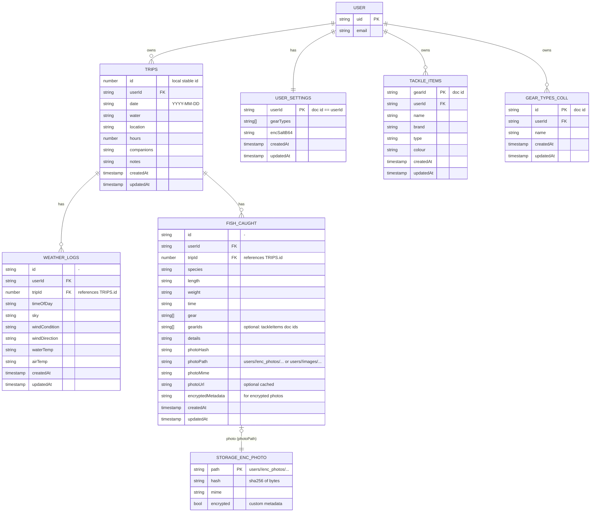
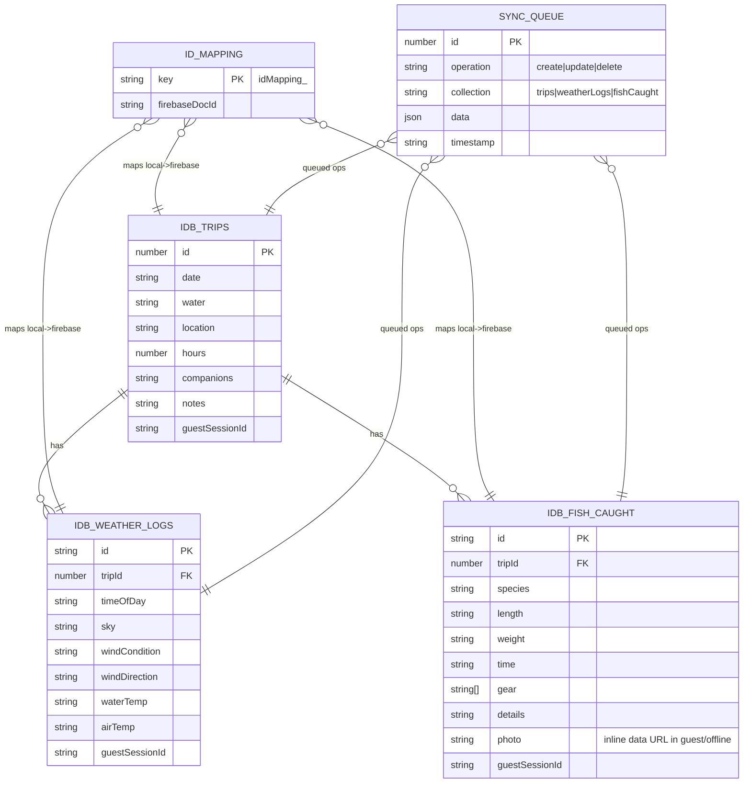
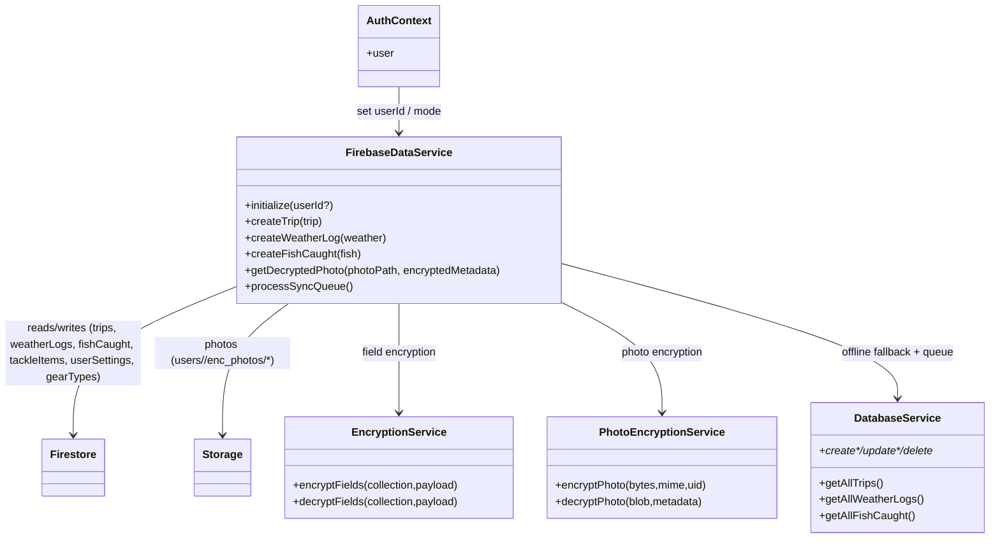
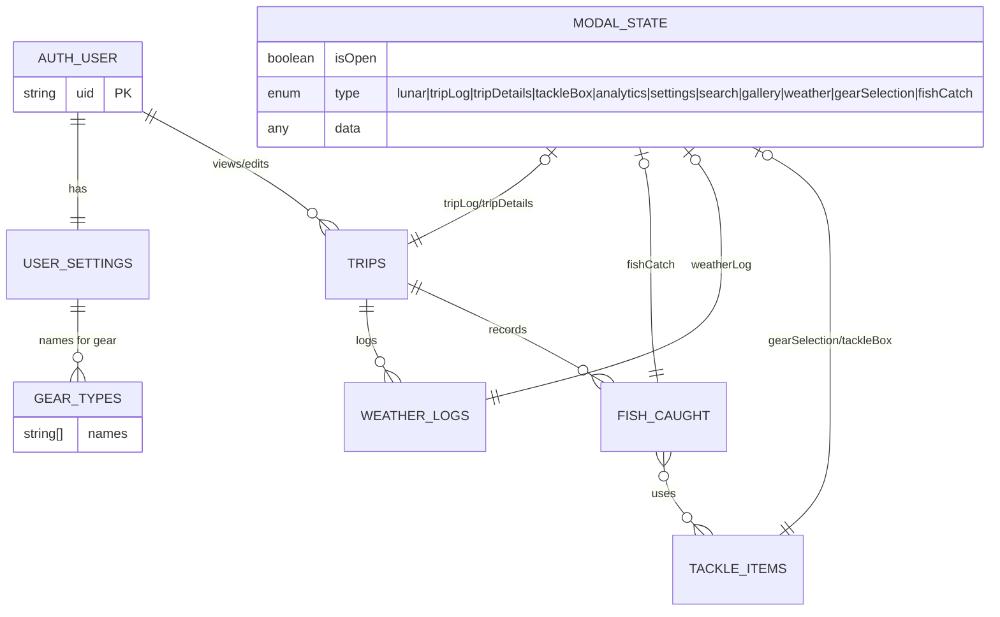

# Data Model and ERDs

This document captures the core data shapes and relationships across the database layer (Firestore + Firebase Storage and local offline stores), service layer models, and primary UI data.

## 1) Firestore + Firebase Storage ERD

Notes:
- Gear types are primarily stored in `userSettings.gearTypes`. A `gearTypes` collection also exists for per-document gear type storage; the app supports both patterns.
- Sensitive fields are deterministically encrypted client-side per `SECURITY.md` (selected string fields in trips/weatherLogs/fishCaught/tackleItems).

## 2) Local (Guest/Offline) Data ERD

## 3) Service Layer Model (Relationships)

## 4) UI Data ERD

— End —
