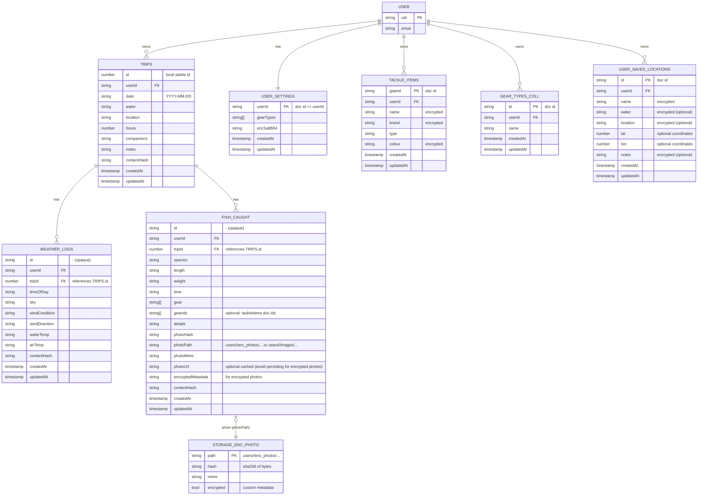

# Data Model and ERDs

This document captures the core data shapes and relationships across the database layer (Firestore + Firebase Storage and local offline stores), service layer models, and primary UI data.

## 1) Firestore + Firebase Storage ERD

Notes:
- Gear types are primarily stored in `userSettings.gearTypes`. The `gearTypes` collection exists but is deprecated for most flows to avoid drift.
- Sensitive fields are deterministically encrypted client-side per `SECURITY.md` (selected string fields in trips/weatherLogs/fishCaught/tackleItems/userSavedLocations).
- **Tackle Items Encryption**: `name`, `brand`, and `colour` fields are encrypted before writing to Firestore. The `type` field remains plaintext to enable filtering/grouping. Decryption occurs automatically when loading tackle items, with a timing consideration: tackle items are reloaded once the encryption service is initialized after login to ensure proper decryption.
- Weather/Fish IDs are opaque and use a ULID-based suffix; UI should not parse IDs.
- Saved locations are limited to 10 per user (hard cap enforced at service level).
- Duplicate location prevention uses 11-meter coordinate tolerance (0.0001 degrees).
- Saved locations encrypt name, water, location, and notes fields client-side.
 
### Update semantics and guardrails (to prevent data loss and display drift)
- FISH_CAUGHT photo fields are preserved on updates unless an explicit removal signal is provided. Clients MUST NOT clear photo-related fields by omission.
  - To remove a photo, send one of: `photo: ''` or `photoPath: ''` or `photoUrl: ''` or `removePhoto: true`.
  - To keep an existing photo unchanged, do not include any photo fields in the update payload.
  - To replace a photo, set `photo` to a data URL; the service will move it to Storage and populate `photoPath` (+ `encryptedMetadata` when encrypted). For encrypted photos, `photoUrl` may remain empty by design.
  - When editing locally cached records (IndexedDB/guest mode), merge the existing photo metadata (`photoPath`, `photoUrl`, `photoHash`, `photoMime`, `encryptedMetadata`) into the update payload so the client-side store does not drop references while Firestore keeps them.
- Gear rename propagation runs asynchronously. UI should enqueue rename tasks (via the gear maintenance service) and surface progress feedback rather than blocking the modal while catch records are updated. The maintenance service now emits canonical rename events (`gear-rename-applied`, `gear-type-rename-applied`) immediately after writing both Firestore and IndexedDB; consumers (e.g., Trip Log) must subscribe and update in-memory state to keep denormalized gear labels in sync without requiring a full refresh. When normalizing catch gear locally, prefer existing composite entries (`type|brand|name|colour`) over tackle-box fallbacks so freshly renamed records are not overwritten by stale name-only values.
- Encrypted photos: prefer `photoPath` + `encryptedMetadata`; `photoUrl` is optional and often blank for encrypted objects (download URLs are fetched on demand).
- UI photo handling: gallery listings and modal viewers seed placeholder entries for storage-backed photos so every `fishCaught` record with a `photoPath` appears immediately, then hydrate with decrypted/pre-signed URLs when available. Trip Log, Fish Catch, and Gallery modals all invoke the shared `PhotoViewerModal`, ensuring identical sizing, metadata layout, and sign-in prompts when full-screening images; the viewer automatically closes when its parent modal unmounts, avoiding orphaned overlays.
 

## 2) Local (Guest/Offline) Data ERD

Notes:
- Guest users store saved locations in localStorage under `savedLocations` key (not synced to Firestore).
- Each guest session maintains its own saved locations list (10-item limit applies).

## 3) Service Layer Model (Relationships)

Notes:
- Saved locations use Firestore for authenticated users, localStorage for guests.
- 10-location limit enforced at service level with duplicate coordinate detection.
- CRUD operations emit `savedLocationsChanged` events for reactive UI updates.
- **Tackle Items Decryption Flow**: When authenticated users load tackle items, `useFirebaseTackleBox` and `firebaseDataService.getAllTackleItems()` automatically decrypt encrypted fields. The hook monitors `AuthContext.encryptionReady` to reload items once encryption service initialization completes, ensuring proper decryption timing after login.

## 4) UI Data ERD

Notes:
- Saved locations are managed exclusively through Settings modal (consolidated from previously duplicated UI in CurrentMoonInfo, LunarModal, and Settings).
- CurrentMoonInfo and LunarModal provide read-only location displays with "Change Location" / "Set Location" buttons that open Settings.
- LocationContext provides app-wide access to saved locations state and CRUD operations.
- Saved locations can be selected to auto-fill water and location fields in trip forms.
- Location search includes GPS location detection, Google Places autocomplete, and manual coordinate entry.

— End —
